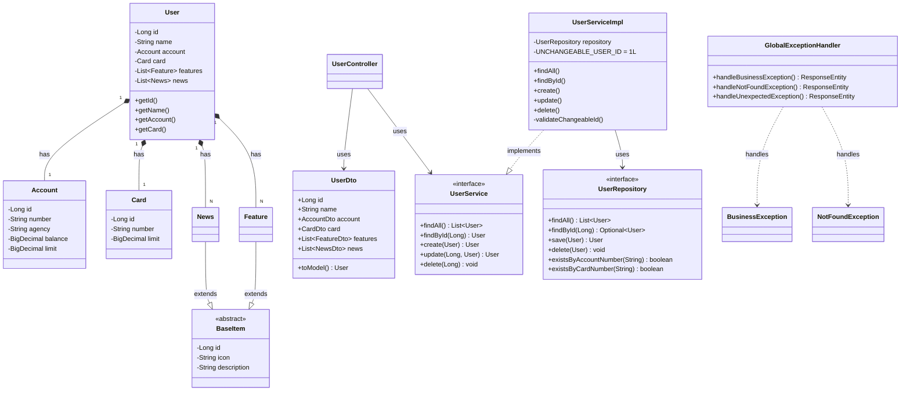

# 🏦 Santander Bootcamp - RESTful API

API RESTful desenvolvida em Java durante o Bootcamp Santander, implementando um sistema de gerenciamento de usuários bancários com contas, cartões, funcionalidades e notícias.

## 📋 Índice

- [Visão Geral](#-visão-geral)
- [Tecnologias](#-tecnologias)
- [Arquitetura](#-arquitetura)
- [Estrutura do Projeto](#-estrutura-do-projeto)
- [Funcionalidades](#%EF%B8%8F-funcionalidades)
- [Regras de Negócio](#-regras-de-negócio)
- [Diagrama de Classes](#-diagrama-de-classes)
- [Pré-requisitos](#-pré-requisitos)
- [Como Executar](#-como-executar)
- [Documentação da API](#-documentação-da-api)
- [Testes](#testes)
- [Cobertura de Código](#-cobertura-de-código)
- [Deploy](#-deploy)
- [Estrutura de Dados](#-estrutura-de-dados)

---

## 🎯 Visão Geral

Esta API fornece endpoints RESTful para gerenciamento completo de usuários bancários, incluindo:

- **CRUD completo** de usuários
- **Gestão de contas bancárias** com número único
- **Gestão de cartões** com limite disponível
- **Funcionalidades** e **Notícias** associadas aos usuários
- **Validações de negócio** robustas
- **Tratamento centralizado de exceções**
- **Documentação interativa** via Swagger/OpenAPI

---

## 🛠 Tecnologias

### Core

- **Java 17** - Linguagem de programação
- **Spring Boot 3.5.7** - Framework principal
- **Spring Data JPA** - Persistência de dados
- **Spring Web** - API RESTful

### Banco de Dados

- **H2 Database** - Banco em memória (desenvolvimento/testes)
- **PostgreSQL** - Banco de dados de produção

### Documentação

- **SpringDoc OpenAPI 3** - Documentação interativa da API (Swagger UI)

### Testes

- **JUnit 5** - Framework de testes
- **Mockito** - Framework de mocking
- **Spring Boot Test** - Testes de integração
- **JaCoCo 0.8.11** - Análise de cobertura de código

### Build & Deploy

- **Gradle** - Gerenciador de dependências e build
- **Nixpacks** - Configuração de deploy

---

## 🏗 Arquitetura

A aplicação segue os princípios da **Arquitetura em Camadas** e **DDD (Domain-Driven Design)**:

```bash
┌─────────────────────────────────────┐
│   Controller Layer (REST API)       │
│   - UserController                  │
│   - DTOs (Data Transfer Objects)    │
│   - GlobalExceptionHandler          │
└─────────────────────────────────────┘
              ↓
┌─────────────────────────────────────┐
│   Service Layer (Business Logic)    │
│   - UserService / UserServiceImpl   │
│   - BusinessException               │
│   - NotFoundException               │
└─────────────────────────────────────┘
              ↓
┌─────────────────────────────────────┐
│   Repository Layer (Data Access)    │
│   - UserRepository (JPA)            │
└─────────────────────────────────────┘
              ↓
┌─────────────────────────────────────┐
│   Domain Layer (Entities)           │
│   - User, Account, Card             │
│   - Feature, News                   │
└─────────────────────────────────────┘
```

### Camadas

1. **Controller**: Recebe requisições HTTP e retorna respostas JSON
2. **Service**: Contém a lógica de negócio e validações
3. **Repository**: Acesso aos dados através do Spring Data JPA
4. **Domain**: Entidades JPA que representam o modelo de dados

---

## 📁 Estrutura do Projeto

```bash
santander-bootcamp/
├── src/
│   ├── main/
│   │   ├── java/me/dio/santander_bootcamp/
│   │   │   ├── Application.java                    # Classe principal
│   │   │   ├── controller/                          # Camada de controle
│   │   │   │   ├── UserController.java             # Endpoints REST
│   │   │   │   ├── dto/                            # Data Transfer Objects
│   │   │   │   │   ├── UserDto.java
│   │   │   │   │   ├── AccountDto.java
│   │   │   │   │   ├── CardDto.java
│   │   │   │   │   ├── FeatureDto.java
│   │   │   │   │   └── NewsDto.java
│   │   │   │   └── exception/
│   │   │   │       └── GlobalExceptionHandler.java # Tratamento global
│   │   │   ├── service/                            # Camada de serviço
│   │   │   │   ├── UserService.java                # Interface
│   │   │   │   ├── CrudService.java                # Interface genérica CRUD
│   │   │   │   ├── impl/
│   │   │   │   │   └── UserServiceImpl.java        # Implementação
│   │   │   │   └── exception/
│   │   │   │       ├── BusinessException.java
│   │   │   │       └── NotFoundException.java
│   │   │   └── domain/                             # Camada de domínio
│   │   │       ├── model/                          # Entidades JPA
│   │   │       │   ├── User.java
│   │   │       │   ├── Account.java
│   │   │       │   ├── Card.java
│   │   │       │   ├── Feature.java
│   │   │       │   ├── News.java
│   │   │       │   └── BaseItem.java              # Classe base
│   │   │       └── repository/
│   │   │           └── UserRepository.java         # Repositório JPA
│   │   └── resources/
│   │       ├── application-dev.yml                 # Config dev (H2)
│   │       └── application-prd.yml                 # Config prod (PostgreSQL)
│   └── test/                                       # Testes
│       └── java/me/dio/santander_bootcamp/
│           ├── controller/
│           │   ├── UserControllerTest.java         # Testes do controller
│           │   └── dto/
│           │       └── UserDtoTest.java           # Testes de DTOs
│           ├── service/impl/
│           │   └── UserServiceImplTest.java        # Testes unitários
│           └── integration/
│               └── UserIntegrationTest.java        # Testes de integração
├── build.gradle                                    # Configuração Gradle
├── Procfile                                        # Configuração deploy
├── nixpacks.toml                                   # Configuração Nixpacks
└── README.md                                       # Este arquivo
```

---

## ⚙️ Funcionalidades

### Endpoints RESTful

| Método   | Endpoint      | Descrição                  | Status Codes  |
| -------- | ------------- | -------------------------- | ------------- |
| `GET`    | `/users`      | Lista todos os usuários    | 200           |
| `GET`    | `/users/{id}` | Busca usuário por ID       | 200, 404      |
| `POST`   | `/users`      | Cria novo usuário          | 201, 422      |
| `PUT`    | `/users/{id}` | Atualiza usuário existente | 200, 404, 422 |
| `DELETE` | `/users/{id}` | Remove usuário             | 204, 404, 422 |

### Funcionalidades por Endpoint

#### `GET /users`

- Retorna lista completa de usuários com todas as informações
- Resposta: `List<UserDto>`

#### `GET /users/{id}`

- Busca usuário específico por ID
- Inclui: conta, cartão, funcionalidades e notícias
- Retorna 404 se não encontrado

#### `POST /users`

- Cria novo usuário com validações:
  - Usuário não pode ser null
  - Conta e cartão obrigatórios
  - Número de conta único
  - Número de cartão único
  - ID 1 não pode ser criado
- Retorna header `Location` com URL do recurso criado

#### `PUT /users/{id}`

- Atualiza dados do usuário
- Validações:
  - ID do path deve corresponder ao ID do body
  - ID 1 não pode ser atualizado
- Atualiza: nome, conta, cartão, funcionalidades e notícias

#### `DELETE /users/{id}`

- Remove usuário do sistema
- ID 1 não pode ser deletado
- Remove cascata: conta, cartão, funcionalidades e notícias

---

## 🔒 Regras de Negócio

### Validações de Criação

1. ✅ Usuário não pode ser `null`
2. ✅ Conta bancária obrigatória
3. ✅ Cartão obrigatório
4. ✅ Número de conta deve ser **único** no sistema
5. ✅ Número de cartão deve ser **único** no sistema
6. ✅ Usuário com ID `1` **não pode ser criado** (reservado)

### Validações de Atualização

1. ✅ ID do path deve corresponder ao ID do body
2. ✅ Usuário deve existir no banco
3. ✅ Usuário com ID `1` **não pode ser atualizado**

### Validações de Remoção

1. ✅ Usuário deve existir no banco
2. ✅ Usuário com ID `1` **não pode ser deletado**

### Constraints de Banco de Dados

- **Account.number**: `UNIQUE` (número de conta único)
- **Card.number**: `UNIQUE` (número de cartão único)
- **Account.balance**: `DECIMAL(13,2)` (precisão monetária)
- **Account.limit**: `DECIMAL(13,2)` (precisão monetária)
- **Card.limit**: `DECIMAL(13,2)` (precisão monetária)

---

## 📊 Diagrama de Classes



---

## 📋 Pré-requisitos

- **Java 17** ou superior
- **Gradle 7.x** ou superior (ou usar o `gradlew` incluído)
- **PostgreSQL** (para produção) - opcional para desenvolvimento
- **Maven Central** acessível (para download de dependências)

---

## 🚀 Como Executar

### 1. Clonar o Repositório

```bash
git clone <repository-url>
cd santander-bootcamp
```

### 2. Executar em Desenvolvimento (H2 Database)

```bash
# Windows
gradlew.bat bootRun

# Linux/Mac
./gradlew bootRun
```

A aplicação estará disponível em: `http://localhost:8080`

### 3. Executar com PostgreSQL

#### Configurar variáveis de ambiente

```bash
export PGHOST=localhost
export PGPORT=5432
export PGDATABASE=santander_bootcamp
export PGUSER=postgres
export PGPASSWORD=senha
```

#### Executar com profile de produção

```bash
./gradlew bootRun --args='--spring.profiles.active=prd'
```

### 4. Build do Projeto

```bash
# Compilar e gerar JAR
./gradlew build

# JAR será gerado em: build/libs/santander-bootcamp-0.0.1-SNAPSHOT.jar
```

### 5. Executar JAR

```bash
java -jar build/libs/santander-bootcamp-0.0.1-SNAPSHOT.jar
```

---

## 📚 Documentação da API

### Swagger UI

A documentação interativa está disponível em:

**URL:** `http://localhost:8080/swagger-ui.html`

### Endpoints Documentados

Todos os endpoints estão documentados com:

- ✅ Descrição detalhada
- ✅ Parâmetros de entrada
- ✅ Exemplos de requisição
- ✅ Exemplos de resposta
- ✅ Códigos de status HTTP
- ✅ Possibilidade de testar diretamente na interface

### Exemplo de Requisição

#### Criar Usuário

```http
POST /users
Content-Type: application/json

{
  "name": "João Silva",
  "account": {
    "number": "12345-6",
    "agency": "0001",
    "balance": 1000.00,
    "limit": 500.00
  },
  "card": {
    "number": "1234 5678 9012 3456",
    "limit": 2000.00
  },
  "features": [
    {
      "icon": "icon1.png",
      "description": "Feature 1"
    }
  ],
  "news": [
    {
      "icon": "news1.png",
      "description": "News 1"
    }
  ]
}
```

#### Resposta

```http
HTTP/1.1 201 Created
Location: /users/1
Content-Type: application/json

{
  "id": 1,
  "name": "João Silva",
  "account": {
    "id": 1,
    "number": "12345-6",
    "agency": "0001",
    "balance": 1000.00,
    "limit": 500.00
  },
  "card": {
    "id": 1,
    "number": "1234 5678 9012 3456",
    "limit": 2000.00
  },
  "features": [...],
  "news": [...]
}
```

---

## 🧪 Testes

### Executar Todos os Testes

```bash
./gradlew test
```

### Executar Teste Específico

```bash
./gradlew test --tests UserServiceImplTest
```

### Tipos de Testes Implementados

1. **Testes Unitários** (`UserServiceImplTest`)

   - Testam a lógica de negócio isoladamente
   - Usam mocks do repositório
   - Cobertura de todos os métodos e validações

2. **Testes de Controller** (`UserControllerTest`)

   - Testam endpoints REST usando MockMvc
   - Validam status HTTP e respostas JSON
   - Testam tratamento de erros

3. **Testes de Integração** (`UserIntegrationTest`)

   - Testam fluxo completo com banco de dados real
   - Usam H2 em memória para testes
   - Validam persistência e transações

4. **Testes de DTO** (`UserDtoTest`)
   - Validam conversões Model ↔ DTO
   - Testam serialização/deserialização

### Exemplo de Execução

```bash
# Executar testes e gerar relatório
./gradlew test jacocoTestReport

# Ver relatório HTML
open build/reports/jacoco/test/html/index.html
```

---

## 📈 Cobertura de Código

### JaCoCo Configuration

O projeto utiliza **JaCoCo 0.8.11** para análise de cobertura:

- **Mínimo exigido**: 70% de cobertura
- **Relatórios gerados**: HTML e XML
- **Classes excluídas**: DTOs, Configs, Exceptions, Application

### Gerar Relatório de Cobertura

```bash
# Executar testes e gerar relatório
./gradlew test jacocoTestReport

# Verificar se atingiu mínimo (falha build se não)
./gradlew jacocoTestCoverageVerification
```

### Visualizar Relatório

O relatório HTML está disponível em:

```bash
build/reports/jacoco/test/html/index.html
```

### Cobertura Atual

- ✅ **Service Layer**: Cobertura completa de validações e regras de negócio
- ✅ **Controller Layer**: Todos os endpoints testados
- ✅ **Repository Layer**: Testado via integração
- ✅ **Exception Handling**: Tratamento de erros coberto

---

## 🌐 Deploy

### Configuração para Deploy

#### Procfile

```bash
web: java -jar build/libs/santander-bootcamp-0.0.1-SNAPSHOT.jar
```

#### Nixpacks Configuration

O projeto inclui `nixpacks.toml` para deploy em plataformas compatíveis:

```toml
[phases.setup]
nixPkgs = ["openjdk17"]

[phases.build]
cmds = ["java -version", "./gradlew clean build -x check -x test -Pproduction"]
```

### Variáveis de Ambiente Necessárias

Para produção, configure:

- `PGHOST`: Host do PostgreSQL
- `PGPORT`: Porta do PostgreSQL
- `PGDATABASE`: Nome do banco
- `PGUSER`: Usuário do banco
- `PGPASSWORD`: Senha do banco
- `SPRING_PROFILES_ACTIVE=prd`: Ativa profile de produção

### Build para Produção

```bash
# Build sem testes (mais rápido)
./gradlew clean build -x test

# Build completo
./gradlew clean build
```

---

## 📦 Estrutura de Dados

### Entidades Principais

#### User (tb_user)

- `id`: Long (PK, auto-increment)
- `name`: String
- Relacionamentos: Account (1:1), Card (1:1), Features (1:N), News (1:N)

#### Account (tb_account)

- `id`: Long (PK, auto-increment)
- `number`: String (UNIQUE)
- `agency`: String
- `balance`: BigDecimal(13,2)
- `limit`: BigDecimal(13,2)

#### Card (tb_card)

- `id`: Long (PK, auto-increment)
- `number`: String (UNIQUE)
- `limit`: BigDecimal(13,2)

#### Feature (tb_feature)

- `id`: Long (PK, auto-increment)
- `icon`: String
- `description`: String
- Herda de `BaseItem`

#### News (tb_news)

- `id`: Long (PK, auto-increment)
- `icon`: String
- `description`: String
- Herda de `BaseItem`

### Relacionamentos

- **User ↔ Account**: `@OneToOne` com `CascadeType.ALL`
- **User ↔ Card**: `@OneToOne` com `CascadeType.ALL`
- **User ↔ Features**: `@OneToMany` com `CascadeType.ALL` e `FetchType.EAGER`
- **User ↔ News**: `@OneToMany` com `CascadeType.ALL` e `FetchType.EAGER`

---

## 🔧 Tratamento de Exceções

### Exceções Customizadas

#### BusinessException (422)

- Lançada para erros de validação de negócio
- Exemplos: conta duplicada, cartão duplicado, ID 1 não permitido

#### NotFoundException (404)

- Lançada quando recurso não é encontrado
- Herda de `BusinessException`

### GlobalExceptionHandler

Tratamento centralizado de exceções:

- `BusinessException` → `422 Unprocessable Entity`
- `NotFoundException` → `404 Not Found`
- `Throwable` → `500 Internal Server Error` (com logging)

---

## 📝 Convenções de Código

### Nomenclatura

- **Classes**: PascalCase (`UserServiceImpl`)
- **Métodos**: camelCase (`findById`)
- **Constantes**: UPPER_SNAKE_CASE (`UNCHANGEABLE_USER_ID`)
- **Variáveis**: camelCase (`userToCreate`)

### Padrões Utilizados

- **DTO Pattern**: Separação entre camadas
- **Repository Pattern**: Abstração de acesso a dados
- **Service Layer Pattern**: Lógica de negócio isolada
- **Exception Handling**: Tratamento centralizado

---

## 📖 Documentação Adicional

- **Swagger UI**: Acesse `/swagger-ui.html` para documentação interativa da API
- **H2 Console**: Acesse `/h2-console` (apenas em desenvolvimento)

---

## 👥 Contribuição

Este projeto foi desenvolvido como parte do Bootcamp Santander da DIO.

---

## 🎓 Aprendizados

- ✅ Arquitetura em camadas com Spring Boot
- ✅ DDD (Domain-Driven Design)
- ✅ RESTful API design
- ✅ JPA/Hibernate e Spring Data JPA
- ✅ Testes unitários e de integração
- ✅ Cobertura de código com JaCoCo
- ✅ Documentação com Swagger/OpenAPI
- ✅ Tratamento de exceções
- ✅ Validações de negócio
- ✅ Deploy e configuração multi-ambiente

---
